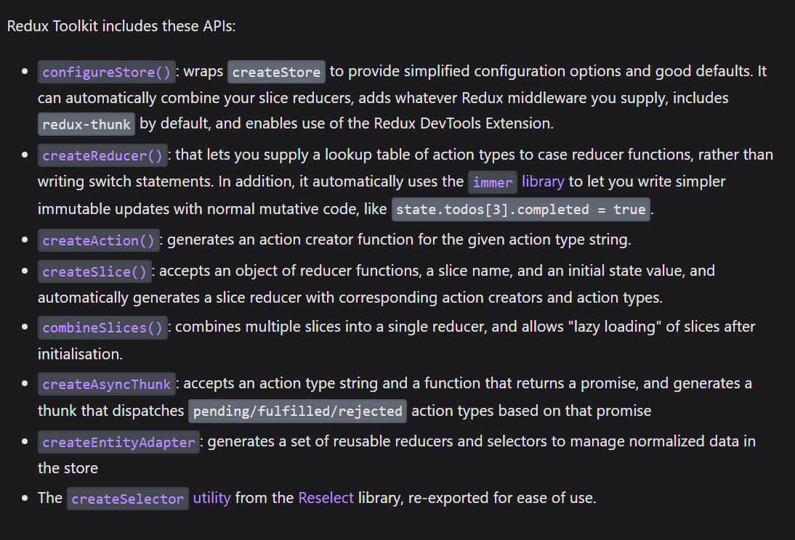
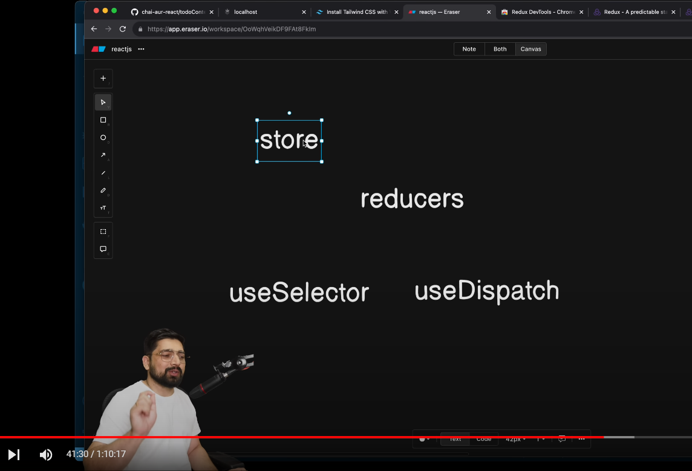

  
- Redux and React Redux are different things  
- Redux is a core library and React Redux is a support lib for the react taaki redux an dreact ki aapas me baatchit ho ske
### Steps to implement this
1. Create `store.js` file and ye store file ek object export krti hai and store apni values ko update reduceer ki help se krta hai.   
Reducer is more like ki use store me register krna pdega taaki pta rhe store ko  
2. Create `Reduce` so make a folder of feature and then uske agar `slice ` bnao isme functions ko  `slice` bola jaata hai +> Reducers whn ek  object hai
  
3. `Dispatch()` it handles the value isme Id and functionalities hoti hain jo reducers ki help se hoti hain   
4. `useSelector()` A hook to access the redux store's state. This hook takes a selector function as an argument. The selector is called with the store state.   
-This hook takes an optional equality comparison function as the second parameter that allows you to customize the way the selected state is compared to determine whether the component needs to be re-rendered